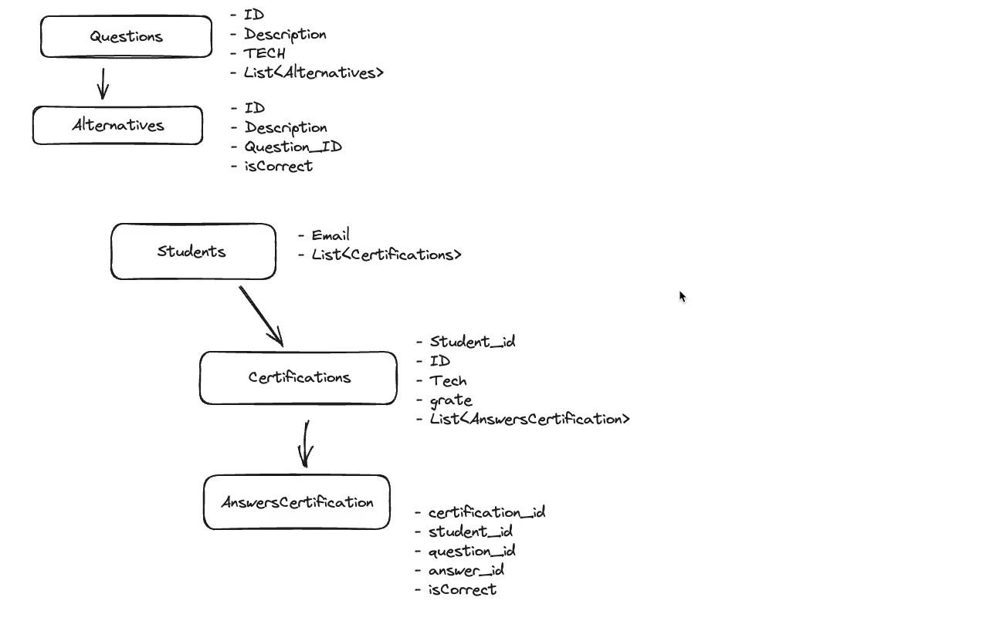

# Certification Service

Serviço de certificações, onde o estudante pode fazer provas para obter suas certificações e dentro do sistema há um ranqueamento próprio, destacando os 10 melhores classificados nas avaliações.

## Configurações 

- Clone o repositório 
- Configure o Docker(`docker-compose up -d`)
- Suba o banco de dados, Rodando o arquivo(`CreateSeed`)
- Suba a aplicação(`mvn spring-boot:run`)
- Teste a aplicação no Rest Client

## Diagrama da aplicação

  

## Tecnologias

- [Docker](https://www.docker.com/)
- [Java](https://www.oracle.com/br/java/technologies/downloads/)
- [Spring Data JPA](https://spring.io/projects/spring-data-jpa)
- [Spring MVC](https://spring.io/guides/gs/serving-web-content)

<!--START_SECTION:footer-->
 

## 🔗 Connect with me

<!--END_SECTION:footer-->